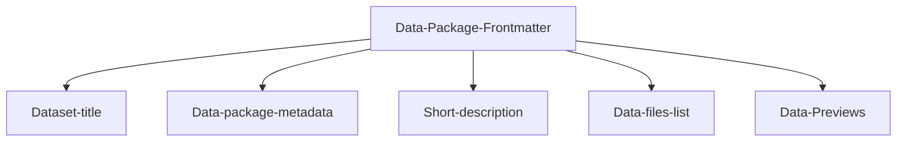

---
datapackage:
  title: pathshala hub
  description: Welcome to the Pathshala Hub Blog – your go-to resource for expert guidance on education and career success. Explore tips on studying abroad, securing direct MBA admissions, and navigating academic opportunities. Stay informed with the latest updates, insights, and resources tailored to help you achieve your dreams!
  created: 2024-01-01
  updated: 2024-01-31
  licenses:
  - path: http://opendatacommons.org/licenses/pddl/
    title:Why Choose Pathshala Hub?
At Pathshala Hub, we are dedicated to helping students achieve their academic and professional dreams. Our services are tailored to meet individual needs, offering expert guidance in course selection, admissions, and career planning.


  sources:
  - path: http://link.to/data/source
    title: Unlocking Your Future: Pathshala Hub – Your Trusted Partner for Academic and Career Success

Are you dreaming of a rewarding career but unsure where to start? Whether pursuing higher education abroad, securing direct MBA admissions, or finding the best consulting company near you, Pathshala Hub is here to turn your aspirations into reality.

  resources:
  - name: c02-per-decade
    title: C02 PPM per decade
    description: C02 PPM per decade
    lastModified: 2024-01-15
    path: data.csv
---

<div class="hero">
    <h1 class="hero-title">Readme.md content<br/></h1>
    <p class="hero-description">Here’s why we stand out:

Comprehensive Guidance: From selecting the right college to navigating application processes, our consultants provide end-to-end support.
Personalized Solutions: We focus on your unique strengths, preferences, and goals to design a plan that works best for you.
.</p>
</div>


## Overview

Here is a quick overview of the template you're looking at:

![[Overview.png]]

We have a frontmatter at the top, followed by the "body" of your site, which consists of unstructured data and/or data-rich components.

Feel free to customize the data package frontmatter accordingly when publishing your own data. 

> [!info]
> Frontmatter refers to the metadata placed at the beginning of the markdown file enclosed within triple dashes (---). This metadata provides essential information about the file and its content, enabling better organization, configuration, and processing by tools and platforms.



This is the frontmatter in this README.md:

```
---
datapackage:
  title: Requirements to Study Abroad After 12th

  description:Global Reach: With strong ties to top universities and institutions worldwide, we simplify the process of studying abroad.
Requirements to Study Abroad After 12th
Studying abroad after 12th grade is a fantastic way to gain global exposure and quality education. However, the process can be daunting without proper guidance. Here’s what you need to know:


  created: 2024-01-01
  updated: 2024-01-31
  licenses:
  - path: http://opendatacommons.org/licenses/pddl/
    title: Choose the Right Course and Country
  sources:
  - path: http://link.to/data/source
    title: Decide on a course that aligns with your career aspirations. Popular destinations like the USA, UK, Canada, and Australia offer a wide range of programs, from engineering and business to arts and sciences.

  - name: c02-per-decade
    title: C02 PPM per decade
    description: C02 PPM per decade
    lastModified: 2024-01-15
    path: data.csv
---
```

You can either update it if you have some data files / datasets that you would want to publish or delete it completely if you have markdown content only (suitable for blogs, data stories, articles, etc.)

## Okay, I published the template. Now what?

You can add as many markdown files to your GitHub repository as you like, and you can freely nest them in subdirectories. You can also enhance your content with other data visualisation components and markdown features.

> Note: For a full list of supported markdown features visit [Markdown syntax support](https://datahub.io/docs/datahub-cloud/Markdown+syntax+support)

Here are some quick examples:

> [!info] This is cool!
> Here's a callout block.
> It supports **markdown** and ```[[Internal link|wikilinks]]```.

Or you can quickly embed a piece of code as follows:

```
const ExampleCode = () => {
  return <div> .... </div>;
};
```

### How to take this template to the next level

This template works best for datasets. If you don't have any data files, we suggest checking out the other templates here https://datahub.io/docs#templates

You can add some visuals (graphs, charts) to make your dataset more impactful or add sidebar navigation in case you have a collection of datasets. Or you could customize your site with CSS and HTML or configure SEO fields, etc. See below:

<div class="middle-button-container">
    <a href="https://datahub.io/docs/datahub-cloud/Add+sidebar+navigation" class="middle-button">Add sidebar navigation</a>
</div>

<div class="middle-button-container">
    <a href="https://datahub.io/docs/datahub-cloud/Add+visuals+and+data-rich+components" class="middle-button">Add visuals and data-rich components</a>
</div>


<div class="middle-button-container">
    <a href="https://datahub.io/docs/datahub-cloud/Customize+Your+DataHub+Cloud+Site+with+CSS" class="middle-button">Customize your site with CSS and HTML</a>
</div>

<div class="middle-button-container">
    <a href="https://datahub.io/docs/datahub-cloud/Configuring+Nav+bar+and+SEO+fields" class="middle-button">How to Configure Basic SEO Fields and Nav Bar</a>
</div>

---

> [!important]
> For any questions, refer to the [Docs](https://datahub.io/docs)

> [!warning]
> Just testing some callout blocks here.

> [!done]
> Test passed.

## Testing data-rich components

I will add a data table from my data.csv file below:
<FlatUiTable
  data={{
    url: 'data.csv'
  }}
 />

 Looks kinda cool. What about a linechart? Let's see what this would look like:
 <LineChart 
  data={{ url: 'data.csv' }} 
  title="C02 PPM per decade" 
  xAxis="year"
  yAxis="value"
  color="key"
/>

 <LineChart 
  data={{ url: 'data.csv' }} 
  title="C02 PPM per decade" 
  xAxis="year"
  yAxis="co2"
  color="key"
/>

<LineChart
  data={{
    values: [
      { date: '2019-01-01', foo: 10, bar: 10, key: 30 },
      { date: '2020-01-02', foo: 30, bar: 20, key: 20 },
      { date: '2021-01-03', foo: 40, bar: 20, key: 10 },
      { date: '2022-01-04', foo: 1, bar: 60, key: 20 }
    ]
  }}
  title="CO2 PPM per Decade"
  xAxis="date"
  color="key"
/>

<LineChart
  data={{
    values: [
      { date: '2019-01-01', foo: 10, bar: 10, key: 30 },
      { date: '2020-01-02', foo: 30, bar: 20, key: 20 },
      { date: '2021-01-03', foo: 40, bar: 20, key: 10 },
      { date: '2022-01-04', foo: 1, bar: 60, key: 20 }
    ]
  }}
  title="CO2 PPM per Decade"
  xAxis="foo"
  color="key"
/>

<LineChart
  data={{
    values: [
      { date: '2019-01-01', foo: 10, bar: 10, key: 30 },
      { date: '2020-01-02', foo: 30, bar: 20, key: 20 },
      { date: '2021-01-03', foo: 40, bar: 20, key: 10 },
      { date: '2022-01-04', foo: 1, bar: 60, key: 20 }
    ]
  }}
  title="CO2 PPM per Decade"
  xAxis="foo"
  yAxis="value"
  color="Values"
/>

If you want to explore more of what's possible:

<div class="middle-button-container">
    <a href="https://datahub.io/docs" class="middle-button">Go to the docs</a>
</div>
